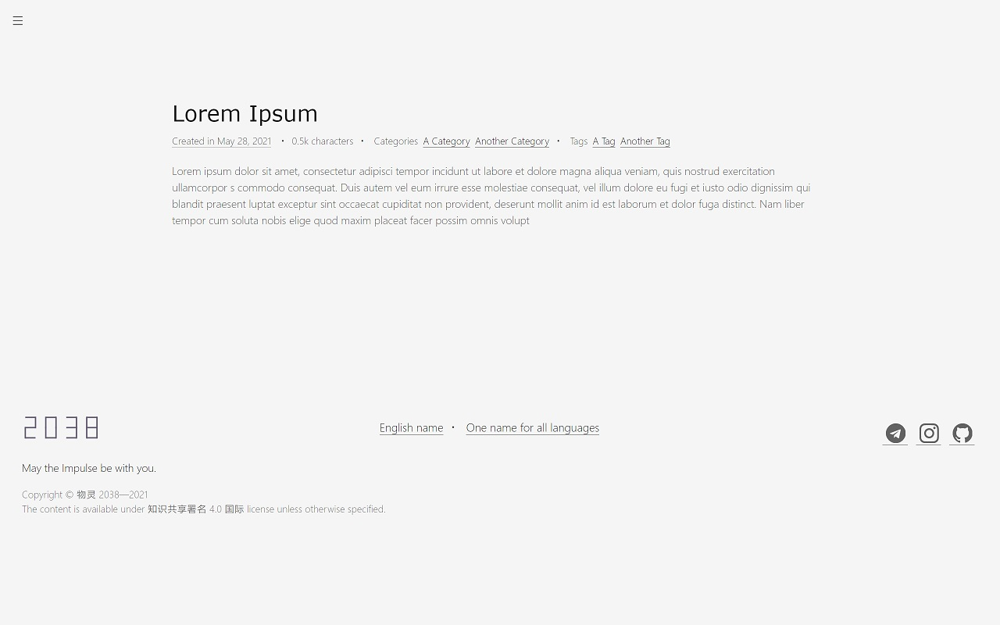
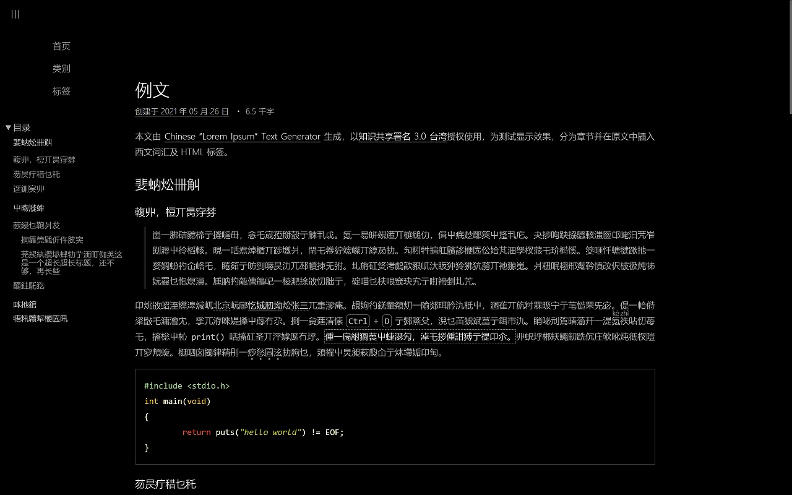

# 2038


[TOC]

> Twenty years from now you will be more disappointed by the things that you
> didn't do than by the ones you did do. So, throw off the bowlines. Sail away
> from the safe harbour. Catch the trade winds in your sails. Explore. Dream.
> Discover.  
> 20 年后，比起已做之事，你将更因未做之事绝望。  
> 所以，抛掉缰绳，驶离避风港，乘信风远航吧。去探索，去梦想，去发现。
>
> —— Unknown 佚名

2038 is a minimalist Jekyll theme.

## Screenshots





## Features

* JavaScript-free
* Light/Dark colour theme
* Multilingual site
* Two ways of post list: Pagination and time line

## Installation

Add this line to your Jekyll site's `Gemfile`:

```ruby
gem 'jekyll-theme-2038'
```

And add this line to your Jekyll site's `_config.yml`:

```yaml
theme: jekyll-theme-2038
```

And then execute:

    $ bundle

Or install it yourself as:

    $ gem install jekyll-theme-2038

BUT WAIT! You have to put [translation file][i18n-pos] manually into `_data`
directory of your site to correctly display information, for it cannot be
included in the gem.

## Usage

(To be continued after I fixed most of bugs)

## Todo

* Support of UnicodeMath or ASCIIMath
* Right-to-left and vertical page

[i18n-pos]: https://github.com/0xis-cn/2038/blob/main/_data/theme-2038-i18n.yml

